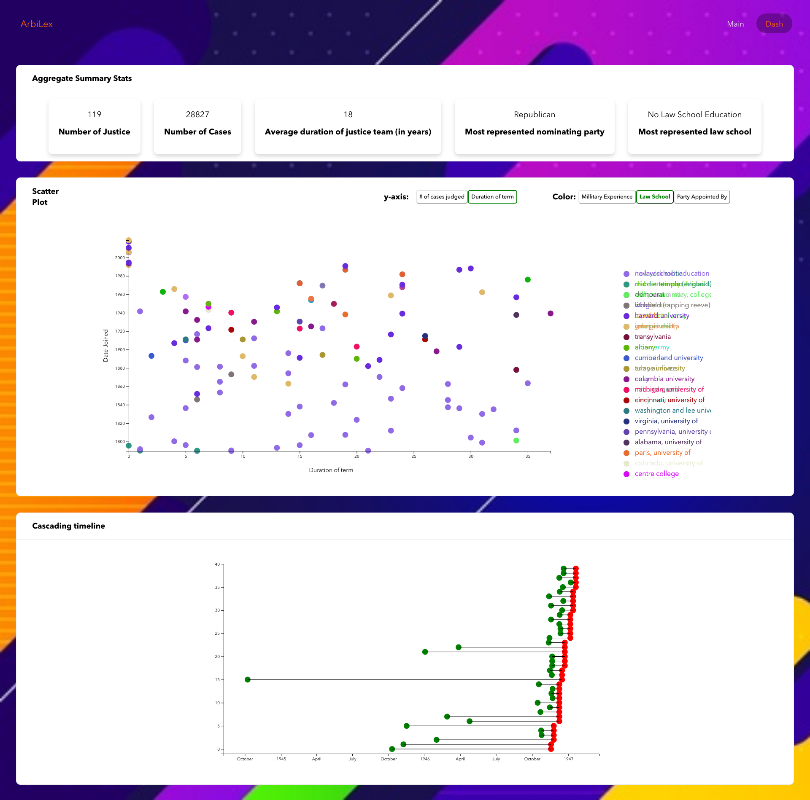

# arbilex-legal-app
Legal application to parse and create data dashboard.

## Tech Stack

| | | |
|:-------------------------:|:-------------------------:|:-------------------------:|
| |  ||

## Folder

### client - client react folder
### server/server/api - server project

## How to run

1. Run the server and client separately on 3000 and 8000 ports respectively. 

### Installation 

#### Server

1. cd int `server` folder 
2. pip install -r requirements.txt
3. python manage.py migrate
4. python manage.py createsuperuser --email admin@example.com --username admin > enter password
5. python manage.py runserver

#### client

1. cd into `client` folder
2. npm install
3. npm start

## View

Access application on 127.0.0.1:3000/ and the admin on 127.0.0.1:8000/admin <use your password you created to login>

### Important

Install geckodriver (On MAC)
> brew install geckodriver

### Screenshot

| | | |
|:-------------------------:|:-------------------------:|:-------------------------:|
| |  ||
|  |  ||